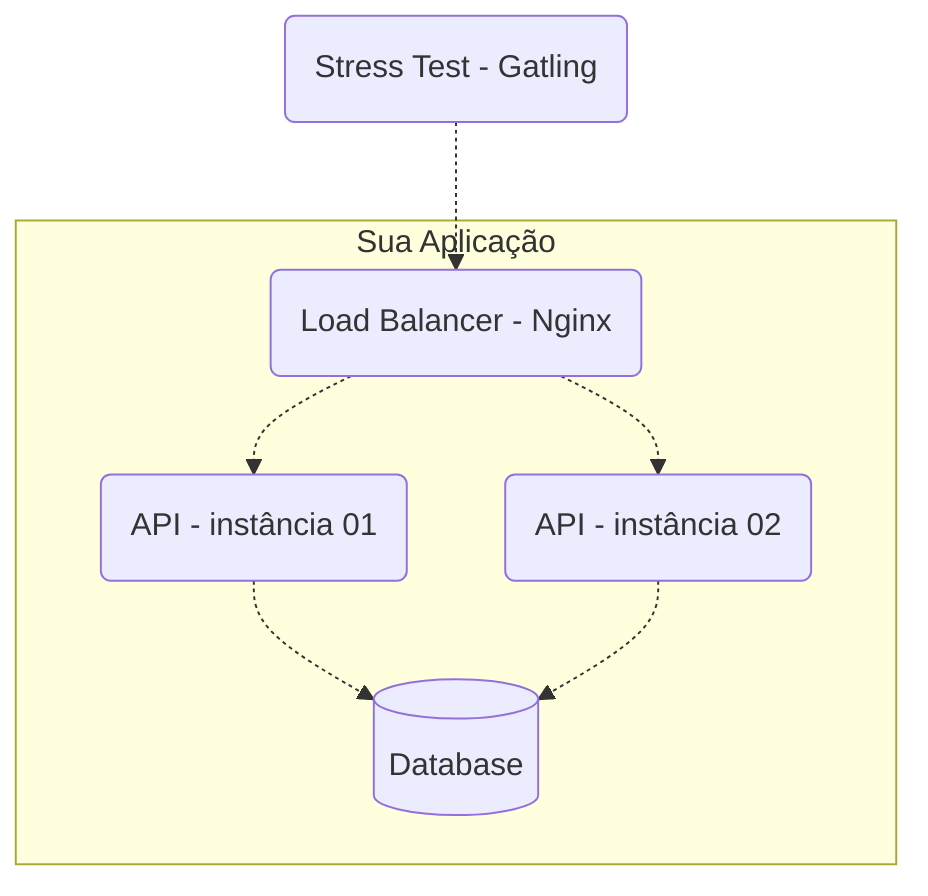

# Rinha de Backend - Edição 2023 Q3


## Resumo

- As APIs precisam expor endpoints iguais e necessariamente usar um dos seguintes bancos de dados (à sua escolha): Postgres, MySQL, ou MongoDB.
- O teste será executado em EC2 devidamente configurado e a limitação de CPU e memória será interessante para exercitarmos ambientes com limitações, use a criatividade;
- A ferramenta [Gatling](https://gatling.io/) será usada para rodar os testes de stress.
- A essência desse torneio não é a competição em si (até mesmo pq não ganha nada quem vencer kkk), mas compartilhar conhecimento.
- Os detalhes do teste de stress [estão aqui!](/stress-test/README.md)

### Criação de Pessoas
`POST /persons`

Deverá aceitar uma requisição em formato JSON com os seguintes parâmetros:

| atributo     | descrição |
|--------------| --- |
| **nickname** | obrigatório, único, string de até 32 caracteres. |
| **name**     | obrigatório, string de até 100 caracteres. |
| **birthday** | obrigatório, string para data no formato AAAA-MM-DD (ano, mês, dia). |
| **stack**    | opcional, vetor de string com cada elemento sendo obrigatório e de até 32 caracteres. |

Para requisições válidas, sua API deverá retornar status code 201 - created junto com o header "Location: /pessoas/[:id]" onde [:id] é o id – em formato UUID com a versão a seu critério – da pessoa que acabou de ser criada. O conteúdo do corpo fica a seu critério; retorne o que quiser. 

Exemplos de requisições válidas:
```json
{
    "nickname" : "josé",
    "name" : "José Roberto",
    "birthday" : "2000-10-01",
    "stack" : ["C#", "Node", "Oracle"]
}
```
```json
{
    "nickname" : "ana",
    "name" : "Ana Barbosa",
    "birthday" : "1985-09-23",
    "stack" : null
}
```
Para requisições inválidas, o status code deve ser 422 - Unprocessable Entity/Content. Aqui, novamente, o conteúdo do corpo fica a seu critério.

Exemplos de requisições inválidas:
```json
{
    "nickname" : "josé", // caso "josé" já tenha sido criado em outra requisição
    "name" : "José Roberto",
    "birthday" : "2000-10-01",
    "stack" : ["C#", "Node", "Oracle"]
}
```

```json
{
    "nickname" : "ana",
    "name" : null, // não pode ser null
    "birthday" : "1985-09-23",
    "stack" : null
}
```

```json
{
    "nickname" : null, // não pode ser null
    "name" : "Ana Barbosa",
    "birthday" : "1985-01-23",
    "stack" : null
}
```

Para o caso de requisições sintaticamente inválidas, a resposta deverá ter o status code para 400 - bad request. Exemplos:

```json
{
    "nickname" : "apelido",
    "name" : 1, // nome deve ser string e não número
    "birthday" : "1985-01-01",
    "stack" : null
}
```

```json
{
    "nickname" : "apelido",
    "name" : "nome",
    "birthday" : "1985-01-01",
    "stack" : [1, "PHP"] // stack deve ser um array de apenas strings
}
```
### Detalhe de uma Pessoa
`GET /pessoas/[:id]`

Deverá retornar os detalhes de uma pessoa caso esta tenha sido criada anteriormente. O parâmetro [:id] deve ser do tipo UUID na versão que escolher. O retorno deve ser como os exemplos a seguir.


```json
{
    "id" : "f7379ae8-8f9b-4cd5-8221-51efe19e721b",
    "nickname" : "josé",
    "name" : "José Roberto",
    "birthday" : "2000-10-01",
    "stack" : ["C#", "Node", "Oracle"]
}
```

```json
{
    "id" : "5ce4668c-4710-4cfb-ae5f-38988d6d49cb",
    "nickname" : "ana",
    "name" : "Ana Barbosa",
    "birthday" : "1985-09-23",
    "stack" : null
}
```

Note que a resposta é praticamente igual ao payload de criação com o acréscimo de `id`. O status code para pessoas que existem deve ser 200 - Ok. Para recursos que não existem, deve-se retornar 404 - Not Found.


### Busca de Pessoas
`GET /persons?t=[:termo da busca]`

Dado o `termo da busca`, a resposta deverá ser uma lista que satisfaça o termo informado estar contido nos atributos `apelido`, `nome`, e/ou elementos de `stack`. A busca não precisa ser paginada e poderá retornar apenas os 50 primeiros registros resultantes da filtragem para facilitar a implementação.

O status code deverá ser sempre 200 - Ok, mesmo para o caso da busca não retornar resultados (vazio).

Exemplos: Dado os recursos seguintes existentes em sua aplicação:

```json
[{
    "id" : "f7379ae8-8f9b-4cd5-8221-51efe19e721b",
    "nickname" : "josé",
    "name" : "José Roberto",
    "birthday" : "2000-10-01",
    "stack" : ["C#", "Node", "Oracle"]
},
{
    "id" : "5ce4668c-4710-4cfb-ae5f-38988d6d49cb",
    "nickname" : "ana",
    "name" : "Ana Barbosa",
    "birthday" : "1985-09-23",
    "stack" : ["Node", "Postgres"]
}]
```

Uma requisição `GET /persons?t=node`, deveria retornar o seguinte:
```json
[{
    "id" : "f7379ae8-8f9b-4cd5-8221-51efe19e721b",
    "nickname" : "josé",
    "name" : "José Roberto",
    "birthday" : "2000-10-01",
    "stack" : ["C#", "Node", "Oracle"]
},
{
    "id" : "5ce4668c-4710-4cfb-ae5f-38988d6d49cb",
    "nickname" : "ana",
    "name" : "Ana Barbosa",
    "birthday" : "1985-09-23",
    "stack" : ["Node", "Postgres"]
}]
```

Uma requisição `GET /persons?t=berto`, deveria retornar o seguinte:
```json
[{
    "id" : "f7379ae8-8f9b-4cd5-8221-51efe19e721b",
    "nickname" : "josé",
    "name" : "José Roberto",
    "birthday" : "2000-10-01",
    "stack" : ["C#", "Node", "Oracle"]
}]
```

Uma requisição `GET /persons?t=Python`, deveria retornar o seguinte:
```json
[]
```

Se a query string `t` não for informada, a resposta deve ter seu status code para 400 - bad request com o corpo que quiser. Ou seja, informar `t` é obrigatório.

### Contagem de Pessoas - Endpoint Especial
`GET /persons/count`

Este é um endpoint especial que NÃO SERÁ TESTADO (portanto, não se preocupe com sua performance) e deverá retornar em texto puro o número de registros de pessoas e qq status code na faixa de 2XX. Ele será usado para validar o número de requisições de criação bem sucedidas durante o teste de stress, por isso não use cache ou qualquer outra forma de materialização que seja eventualmente consistente.

### Nota Importante Sobre Cache e Armazenamento
Você pode usar cache, mas eventualmente todos os registros criados através das requisições `POST /persons` precisam ser persistidos em banco de dados em armazenamento não volátil (disco).

## Restrições de Componentes
O teste terá os seguintes componentes e topologia:



### Stress Test - Gatling
Componente que executará o teste de stress contra sua aplicação.

#### Load Balancer - Nginx
O load balancer foi incluído no teste para simular um ambiente produtivo com mais de uma instância de uma API para maior disponibilidade.

### API - instâncias 01 e 02
Como mencionado, o teste será executado com duas instâncias de sua API. Além de ficar um pouco menos distante de um ambiente produtivo, ter mais de uma instância te obriga a pensar com mais carinho sobre cache, consistência, etc. A estratégia de balanceamento para suas APIs será do tipo round-robin ou fair distribution. Ou seja, o primeiro request irá para a API 01, o segundo para a API 02, o terceiro para a API01 novamente, e assim por diante.

### Database
Como já mencionado no início do documento, você poderá optar por usar Postgres, MySQL, ou MongoDB. Fica a seu critério :)